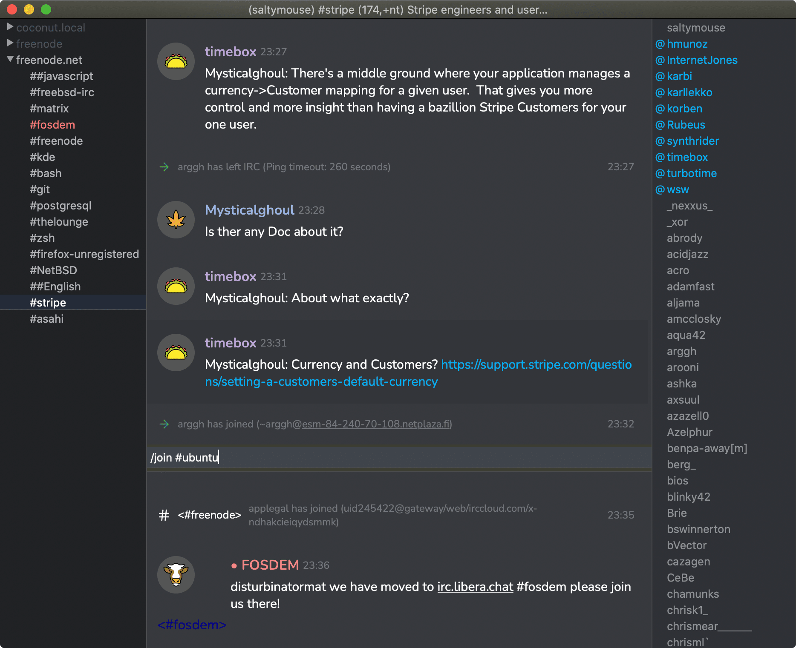

# Discordant

A Discord inspired theme for [LimeChat](https://github.com/psychs/limechat).



## Features

- 🔡 Text is set in [Nunito](https://fonts.google.com/specimen/Nunito) font, similar to Discord's [Uni Sans](https://www.fontfabric.com/fonts/uni-sans/).
- 🦊 Unique\* [Openmoji](https://openmoji.org) avatar for each user's nickname.
- 🌈 Unique‡ colour for each user's nickname.

<sub>\* Based on the first (2) characters of the user's nickname. Users that happen to have the same starting character sequences (beyond 2 characters) will use the same emoji avatar.</sub>  
<sub>‡ Colours are randomly chosen; the same (or similar) colour may be assigned more than once.</sub>

## Basic Install

1. [Click here](https://github.com/salytmouse/limechat-theme-discordant/zipball/master/) to download this project as a zip.
2. Open LimeChat's theme folder.
   - LimeChat Preferences → Theme → Open in Finder
3. Unzip the project zip archive downloaded previously, then drag-and-drop the everything from inside this project's `dist` folder to inside LimeChat's `Themes` revealed earlier.
4. Close, then re-open LimeChat's preferences and select the "discordant" theme from the "Current theme" drop-down menu.

You should end up with a `Themes` folder similar to this:

```
├── Sample.css
├── Sample.yaml
├── discordant-assets        # discordant theme folder
│   ├── fonts
│   └── icons
├── discordant.css           # discordant theme file
├── discordant.yaml          # discordant theme file
├── hipchat-facebook.css
└── hipchat-facebook.yaml
```

## Developer Install

1. Open your LimeChat 'Themes' in your Terminal
2. `npm install` to install dependencies
3. `npm run dev` for local dev (browser preview)
4. `npm run deploy` build and copy files to the `Themes` folder

### Developer Notes

> How it works...

#### Todo

- [ ] Light/Dark mode
- [ ] Oraganise SASS code
  - [ ] Colour theme variables
- [ ] Update `yaml` colours to be more Discordy
- [ ] Setup `<iframe>` in dev-HTML to emulate LimeChat layout
- [ ] Add symbols to nickname comboChars (e.g. `_`)
- [ ] Add JS functionality
